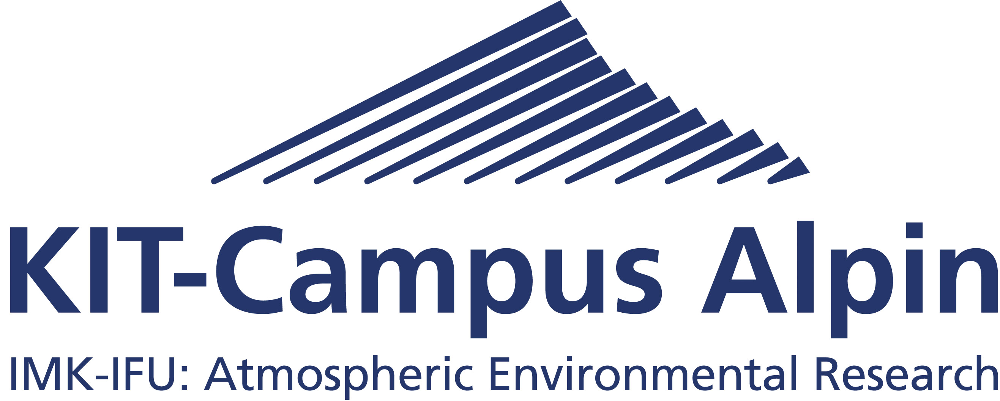
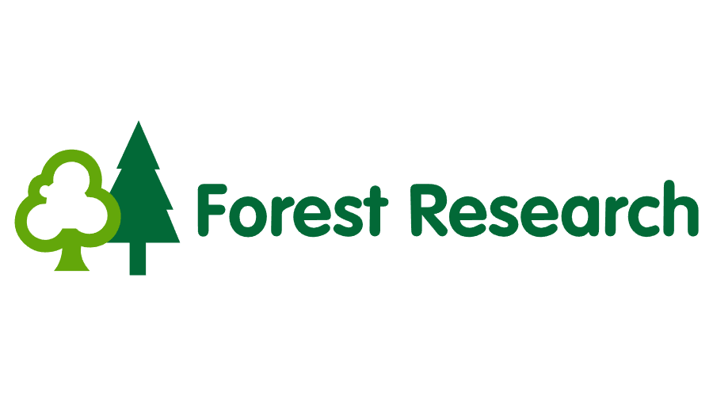
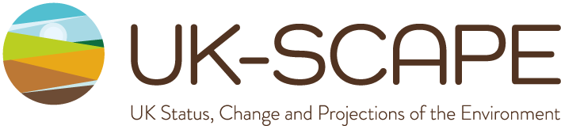

---
output:
  word_document: default
  html_document: default
---
### Release information
 
Release Version 1.026 (September 2021) is the first release of the CRAFTY-GB outcome files, including all the results in CSV format. The files provide summary and spatially explicit information on scenarios and outcomes for the 7 SSPs. To download results, please click the links below. Data is archived in Open Science Framework: <a href="https://doi.org/10.17605/OSF.IO/CY8WE" target="_blank">https://doi.org/10.17605/OSF.IO/CY8WE</a>
 

**The raw CRAFTY outcome files (CSV)**: <a href="https://osf.io/86yfw/" target="_blank">[link]</a> 
**The GeoTIFF files (w/o summary statistics)**: <a href="https://osf.io/jg2h7/" target="_blank">[link]</a>

   

 