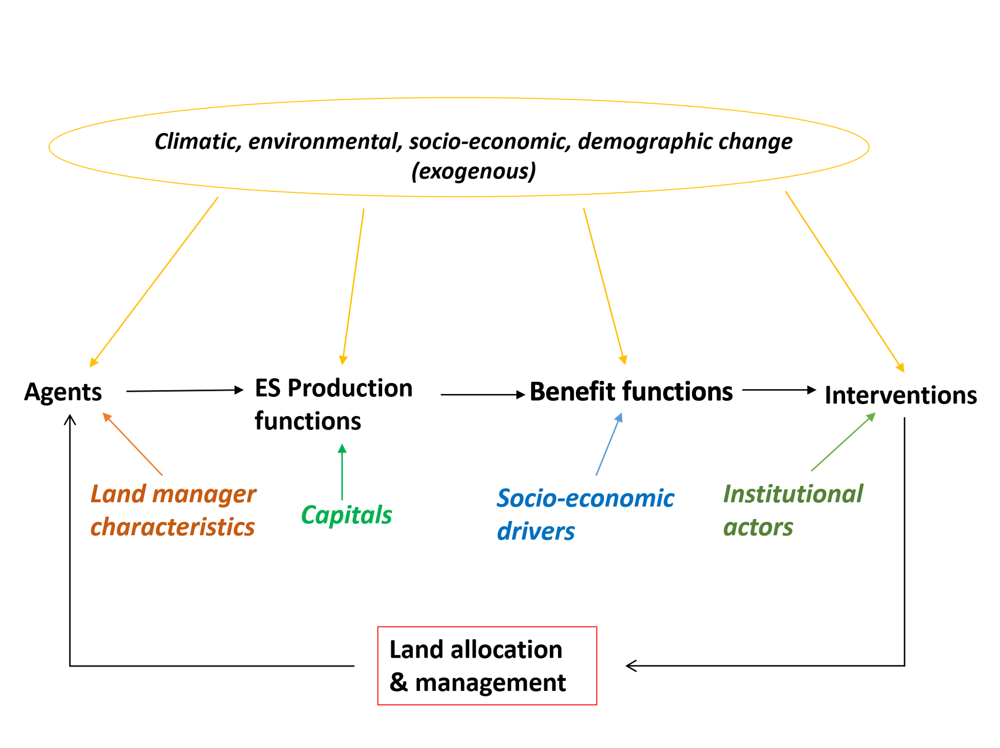

**CRAFTY-EU** is a spatially-explicit agent-based model of land use change in Great Britain. It is an application of the CRAFTY modelling framework [(https://landchange.earth/CRAFTY)](https://landchange.earth/CRAFTY).

The model operates at 10-min resolution and includes agricultural, forestry, urban and conservation land uses at a range of intensities.  The model simulates the provision of a range of ecosystem services, and is linked to the global LandSyMM model [(https://landsymm.earth)](https://landsymm.earth) to account for global effects including trade of food commodities. 

<!--CRAFTY-GB simulates land use change between 2020 and 2080 as the result of climatic and socio-economic impacts derived from the Representative Concentration Pathways (RCPs) and Shared Socioeconomic Pathways (SSPs) global scenarios. These have been tailored to the British context through a combination of computational modelling and stakeholder engagement [[link1]](https://ukscape.ceh.ac.uk/our-science/projects/SPEED/shared-socioeconomic-pathways) [[link2]](https://www.ukclimateresilience.org/projects/uk-socioeconomic-scenarios-for-climate-research-and-policy/).
-->

**To view results, please click 'Model Results'.**

CRAFTY is an open-access modelling framework and full details can be found [here: (https://landchange.earth/CRAFTY/)](https://landchange.earth/CRAFTY/)

<!--A detailed description of CRAFTY-GB [will soon be added / can be found] here [link to model description from paper], and you can access a beta version through the link below:-->

<!--[http://138.246.233.52:3838/CRAFTY_GB/](http://138.246.233.52:3838/CRAFTY_GB/)
 -->
 
<!---->
 
 
