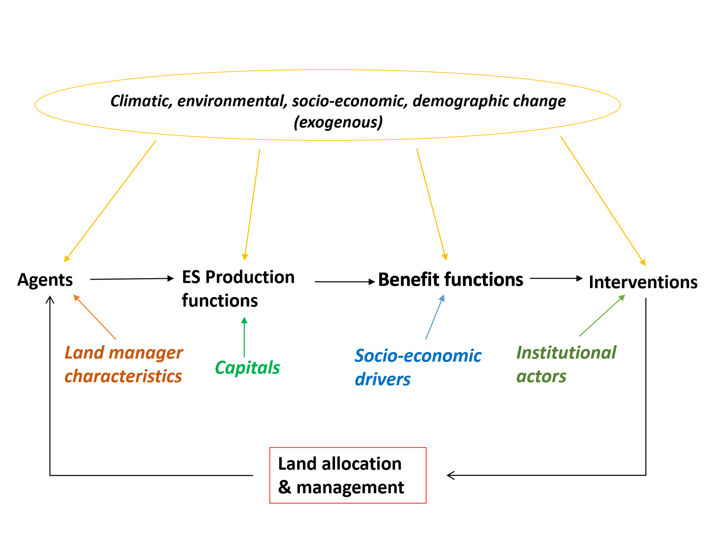

## CRAFTY basic model structure

CRAFTY (Competition for Resources between Agent Functional Types) framework simulates land use change on the basis of:

* Societal demand for ecosystem services
* Converted to economic & non-economic benefits
* Land manager agents compete on the basis of benefit values and behavioural characteristics
* Agents then use capitals describing potential production to provide ecosystem services
* Institutional agents intervene to achieve desired outcomes

<!---->

A schematic of model structure. Agents are characterised by a number of behavioural and productive parameters, and use the potential productivity of a modelled landscape (expressed through capitals) to produce a range of ecosystem services (e.g. food, biodiversity, timber, fresh water, recreation…). These ecosystem services are demanded by an exogenous society (i.e. demand levels for each service are put into the model), and different values are put on different services, so that producing one required unit of one service can bring more benefit than producing one required unit of another. Agents compete for land on the basis of demand levels; those that can produce more services, or more of the most-demanded services, tend to take land over for their particular land use. Meanwhile, institutions (or organisations) monitor land use and intervene in the system in order to satisfy their own particular objectives – for instance a ministry of agriculture might subsidise marginal farmers. Land management can then have a feedback to potential productivity. The usual timestep is 1 year, though longer for forestry.

CRAFTY-GB is designed to operate over large geographical extents and complete land systems, including e.g.

* Agricultural land uses
* Productive & non-productive forest management
* Urban areas
* Conservation
* Range of intensities, objectives and multi-functionalities of each

Model is driven by inputs describing climatic & socio-economic scenario conditions, affecting e.g.

* Yields
* Demand levels
* Financial inputs
* Social capital
* Agent knowledge, social networks, attitudes
* Internal and external trade

Used to explore, e.g.

*     Effects of different supra-economic behaviours
*     Non-equilibrium dynamics
*     Environmental feedbacks
*     Institutional interventions

## Input and output data

CRAFTY core model supplied by range of inputs from data and model sources (substitutable)

## Scenarios 

Scenarios are implemented through a range of conditions:

Climatic conditions affect

* Crop suitabilities/yields
* Tree species growth & timber production
* Global production and trade demands
 
Socio-economic conditions affect

* Human, social, financial & manufactured capitals
* Forest & crop yields through technology
* Societal demand for ecosystem services
* Valuation and benefits for ecosystem services
* Urban land areas
* Agent behaviours: production characteristics, responses to competition and demand, social networks & knowledge
* Global production and trade
